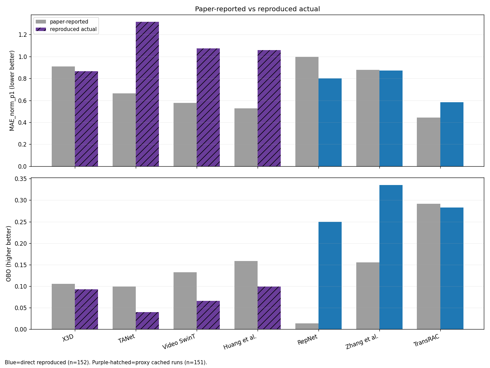

# RepCountExp

This repo tracks RepCount Part-A experiments across official/external deep models and in-house FSM/phase methods.

## 0) All-model summary table (汇总总表)

Metric protocol in this table:
- `MAE_norm_p1 = mean(|pred - gt| / (gt + 0.1))`
- `OBO = mean(|pred - gt| <= 1)`

| Group | Method | N | MAE_norm_p1 | OBO | Source / note |
|---|---|---:|---:|---:|---|
| reproduced-152 | Phase_vote (original) | 152 | 0.4356 | 0.2697 | vote validation |
| reproduced-152 | Phase_vote (soft-penalty) | 152 | 0.4356 | 0.2697 | accumulated-phase + soft confidence |
| reproduced-152 | FSM_baseline | 152 | 0.4453 | 0.4934 | pose-signal baseline |
| reproduced-152 | RepNet_external (multi-stride full) | 152 | 0.4885 | 0.3289 | external checkpoint |
| reproduced-152 | ViewpointFFT_similarity | 152 | 0.5022 | 0.1645 | skeleton cosine similarity + FFT |
| reproduced-152 | TransRAC_official_ckpt | 152 | 0.5826 | 0.2829 | official checkpoint inference |
| reproduced-152 | Phase_native_online (soft-penalty) | 152 | 0.6016 | 0.2500 | var/flip/pause soft penalties |
| reproduced-152 | Phase_native_online (original) | 152 | 0.6686 | 0.1579 | phase-crossing baseline |
| reproduced-152 | RepNet_external (paper64) | 152 | 0.7994 | 0.2500 | single 64-frame protocol |
| reproduced-152 | Zhang_external_resnext101 | 152 | 0.8705 | 0.3355 | external checkpoint |
| cached-151 proxy | X3D_cached16k_proxy | 151 | 0.8663 | 0.0927 | method-inspired proxy on cached embeddings |
| cached-151 proxy | Huang_cached16k_proxy | 151 | 1.0593 | 0.0993 | action-seg inspired proxy |
| cached-151 proxy | VideoSwinT_cached16k_proxy | 151 | 1.0738 | 0.0662 | method-inspired proxy |
|  | peak+phase-vote | 151 | 1.2517 | 0.2632 |  |
| cached-151 proxy | TANet_cached16k_proxy | 151 | 1.3151 | 0.0397 | method-inspired proxy |
| cached-151 historical | transrac_cached16k | 151 | 0.9614 | 0.0795 | in-house replication (old run) |
| cached-151 historical | repnet_like_cached16k | 151 | 1.3461 | 0.0464 | in-house replication (old run) |
| cached-151 historical | zhang_like_cached16k | 151 | 1.3282 | 0.0530 | in-house replication (old run) |
| paper-reported | TransRAC (paper) | 152 | 0.4431 | 0.2913 | CVPR22 Table-2 |
| paper-reported | Huang et al. | 152 | 0.5267 | 0.1589 | CVPR22 Table-2 |
| paper-reported | Video SwinT | 152 | 0.5756 | 0.1324 | CVPR22 Table-2 |
| paper-reported | TANet | 152 | 0.6624 | 0.0993 | CVPR22 Table-2 |
| paper-reported | Zhang et al. | 152 | 0.8786 | 0.1554 | CVPR22 Table-2 |
| paper-reported | X3D | 152 | 0.9105 | 0.1059 | CVPR22 Table-2 |
| paper-reported | RepNet | 152 | 0.9950 | 0.0134 | CVPR22 Table-2 |

Notes:
- `reproduced-152`: evaluated on full Part-A test split (152 videos).
- `cached-151 proxy/historical`: cached-embedding pipeline where current cache test split has 151 videos.
- `paper-reported`: numbers copied from TransRAC paper table for reference, not rerun from official baseline training code.

## 1) Main benchmark (Part-A test, n=152)

Metric protocol used in this table:
- `MAE_norm_p1 = mean(|pred - gt| / (gt + 0.1))`
- `OBO = mean(|pred - gt| <= 1)`

## 2) Paper alignment snapshot (TransRAC Table-2 style)

| Family | Paper (MAE/OBO) | Closest run here | Current (MAE/OBO) |
|---|---|---|---|
| RepNet | 0.9950 / 0.0134 | RepNet external `paper64` | 0.7994 / 0.2500 |
| Zhang et al. | 0.8786 / 0.1554 | Zhang external `resnext101` | 0.8705 / 0.3355 |
| Ours (TransRAC) | 0.4431 / 0.2913 | official ckpt inference | 0.5826 / 0.2829 |

### 2.1 Paper-reported vs actual comparison figure

- figure: `transrac_replication/experiments/paper_vs_actual_comparison.png`
- data table: `transrac_replication/experiments/paper_vs_actual_comparison.csv`

## 3) RepNet protocol sensitivity (same checkpoint)

| Protocol | N | MAE_norm_p1 | OBO |
|---|---:|---:|---:|
| multi-stride full | 152 | 0.4885 | 0.3289 |
| paper64 (single 64-frame clip, GPU) | 152 | 0.7994 | 0.2500 |

## 4) Historical self-trained replication runs (cached embeddings, 16k)

These are in-house replication runs (not official released training pipeline).

| Model | N | MAE_norm_p1 | OBO |
|---|---:|---:|---:|
| transrac_cached16k | 151 | 0.9614 | 0.0795 |
| repnet_like_cached16k | 151 | 1.3461 | 0.0464 |
| zhang_like_cached16k | 151 | 1.3282 | 0.0530 |

## 5) Result files

- Combined benchmark: `transrac_replication/experiments/final_benchmark_combined.csv`
- Simplified benchmark: `transrac_replication/experiments/final_benchmark_simplified_partA_test152.md`
- Paper alignment comparison: `transrac_replication/experiments/paper_alignment_attempt_v2.md`
- Full FSM/phase metrics (test-152): `outputs/04_results/metrics_table_partA_test_all.csv`

## 6) Soft-penalty phase update + confidence calibration

Part-A test (n=152), phase-based versions summary:

### 6.1 Phase-native lineage

| Version | MAE | MAE_norm_p1 | OBO | Event-F1 | Fallback fraction | Notes |
|---|---:|---:|---:|---:|---:|---|
| phase_native_online (original) | 6.6382 | 0.6686 | 0.1579 | 0.4291 | - | phase-crossing baseline |
| phase_native_online (soft-penalty) | 5.1711 | 0.6016 | 0.2500 | 0.4540 | - | added variance/flip/pause soft penalties |

### 6.2 Phase-vote lineage

| Version | MAE | MAE_norm_p1 | OBO | Event-F1 | Fallback fraction | Notes |
|---|---:|---:|---:|---:|---:|---|
| proposed_phase_vote (original) | 6.4868 | 0.4356 | 0.2697 | 0.4046 | - | candidate-window vote validation |
| proposed_phase_vote (soft-penalty) | 6.4868 | 0.4356 | 0.2697 | 0.4046 | - | accumulated-phase + soft confidence terms |
| proposed_phase_vote (online crossing candidates) | 16.0592 | 0.9697 | 0.0263 | 0.0040 | - | candidate source = `online_crossing` |
| proposed_phase_vote (native-online candidates) | 9.8816 | 0.7698 | 0.0526 | 0.3931 | - | candidate source = `native_online_csv` |

Key files:
- soft-penalty metrics: `outputs/04_results/metrics_table_partA_test_all_softpenalty.csv`
- online vote (self-crossing candidates): `outputs/04_results/metrics_table_phase_vote_online_partA_test_all.csv`
- online-compatible vote (native candidates): `outputs/04_results/metrics_table_phase_vote_native_candidates_partA_test_all.csv`
- optional calibration/fallback artifacts (not in main table): `outputs/04_results/phase_native_hybrid_calibration_summary.md`, `outputs/04_results/phase_vote_hybrid_calibration_summary.md`

## 7) Expanded method coverage (TransRAC paper + additional paper)

Expanded table including all methods named in TransRAC CVPR22 Table-2 (paper-reported references) and our reproduced runs:
- `transrac_replication/experiments/expanded_comparison_partA_test152.md`

Additional reproduced entries for Table-2 families (cached-embedding proxy runs, n=151):

| Method family | MAE_norm_p1 | OBO | Summary |
|---|---:|---:|---|
| X3D_cached16k_proxy | 0.8663 | 0.0927 | `transrac_replication/experiments/x3d_cached16k_test_summary.json` |
| TANet_cached16k_proxy | 1.3151 | 0.0397 | `transrac_replication/experiments/tanet_cached16k_test_summary.json` |
| VideoSwinT_cached16k_proxy | 1.0738 | 0.0662 | `transrac_replication/experiments/videoswint_cached16k_test_summary.json` |
| Huang_cached16k_proxy | 1.0593 | 0.0993 | `transrac_replication/experiments/huang_cached16k_test_summary.json` |

Note: these four are method-inspired proxy reproductions trained on cached embeddings (`cache_embeddings_full`), and are listed separately from the paper-reported Table-2 values.

Viewpoint-invariant method adaptation (arXiv:2107.13760) on RepCount-A:
- run summary: `outputs/04_results/viewpoint_fft_partA_test_all_summary.json`
- cross-paper note: `transrac_replication/experiments/expanded_comparison_crosspaper.md`

Main reproduced result (RepCount-A test, n=152):
- `ViewpointFFT_similarity`: `MAE_norm_p1=0.5022`, `OBO=0.1645`

## 8) Detailed confidence figures

Phase-native confidence figures:
- report: `outputs/04_results/confidence_figures/phase_native_confidence_report.md`
- scatter: `outputs/04_results/confidence_figures/phase_native_confidence_vs_abs_err.png`
- histogram: `outputs/04_results/confidence_figures/phase_native_confidence_hist.png`
- binned curve/table: `outputs/04_results/confidence_figures/phase_native_confidence_binned_curve.png`, `outputs/04_results/confidence_figures/phase_native_confidence_binned_metrics.csv`
- threshold search: `outputs/04_results/confidence_figures/phase_native_threshold_search.png`

Phase-vote confidence figures:
- report: `outputs/04_results/confidence_figures/phase_vote_confidence_report.md`
- scatter: `outputs/04_results/confidence_figures/phase_vote_confidence_vs_abs_err.png`
- histogram: `outputs/04_results/confidence_figures/phase_vote_confidence_hist.png`
- binned curve/table: `outputs/04_results/confidence_figures/phase_vote_confidence_binned_curve.png`, `outputs/04_results/confidence_figures/phase_vote_confidence_binned_metrics.csv`
- threshold search: `outputs/04_results/confidence_figures/phase_vote_threshold_search.png`
