# Joint Signal Samples Report

This short note records per-joint 0-10s signal visualizations for representative clips.

For each selected video, we generate one figure per interested joint/signal. Therefore, if a video has `n` configured signals, it produces `n` figures.

## What Each Figure Contains

For each joint/signal, one figure is generated with two panels:

- wrapped phi variants:
  - base wrapped phi
  - filtered wrapped phi
  - low-band wrapped phi
- theta variants:
  - raw theta
  - smoothed theta
  - low-band theta

All phi curves are wrapped-phase views. Unwrapped phi is intentionally omitted here so that branch-cut discontinuities remain visible.

## Exact Definitions Used

- `base wrapped phi`:
  - built from the raw signal branch with robust normalization
  - `atan2(robust_scale(omega_raw), robust_scale(theta_raw))`
- `filtered wrapped phi`:
  - built from the smoothed signal branch with the same robust normalization style
  - `atan2(robust_scale(omega_smooth), robust_scale(theta_smooth))`
- `low-band wrapped phi`:
  - built from low-pass filtered smoothed theta
  - `atan2(robust_scale(omega_low), robust_scale(theta_low))`
- `raw theta`:
  - raw angle signal saved in the `.npz`
- `smoothed theta`:
  - the current pipeline theta after smoothing
- `low-band theta`:
  - extra Butterworth low-pass filtering on top of `smoothed theta`

## Common Settings

- time range shown: first `0-10s`
- low-band filter: Butterworth low-pass
- cutoff: `1.5 Hz`
- order: `3`

Ground-truth repetition boundaries:

- green dashed vertical lines = GT repetition start time
- black dotted vertical lines = GT repetition end time
- GT frame indices are read from `periods_json` in `outputs/00_index/subset_partA_test_all.csv` and converted to seconds using the video FPS

## Output Directories

- `docs/assets/joint_variant_two_videos`
- `docs/assets/joint_variant_requested_videos`

## Squat: `stu4_63`

### Clip Preview (0-10s)

### `knee_flex`

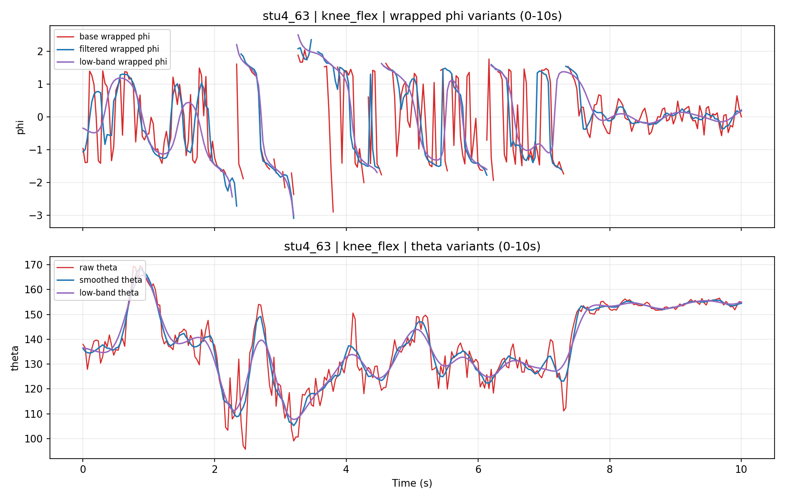

### `hip_flex`

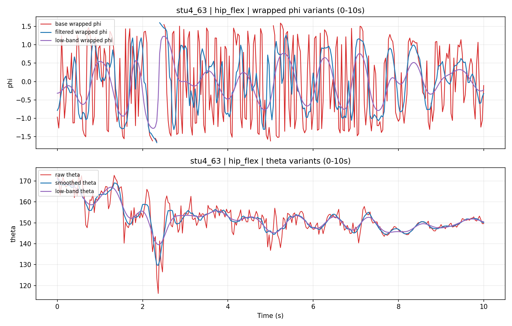

### `trunk_pitch`

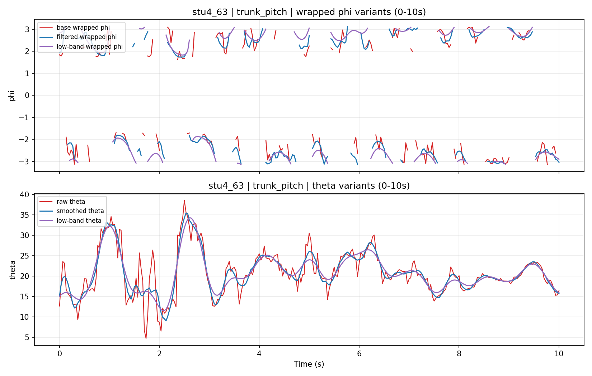

## Push-up: `stu10_43`

### Clip Preview (0-10s)

### `elbow_flex`

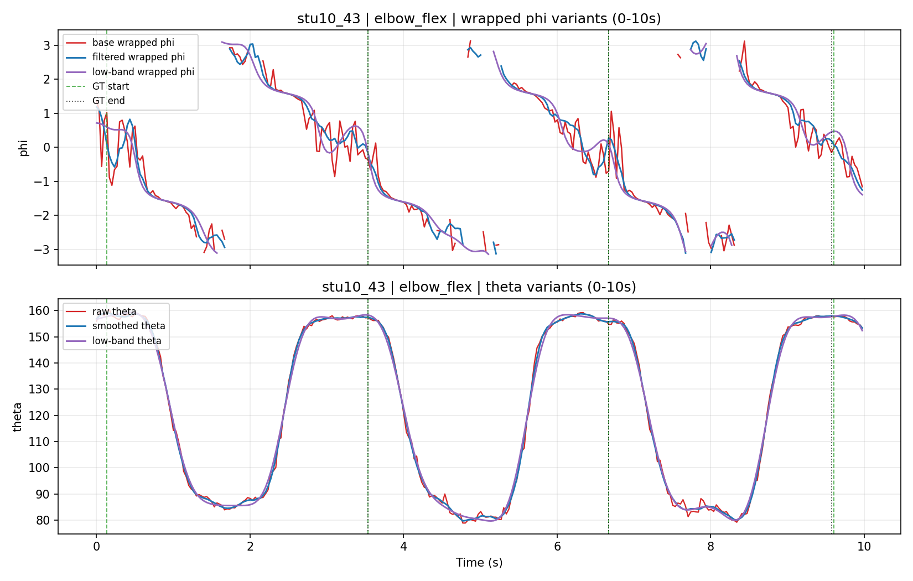

### `shoulder_ang`

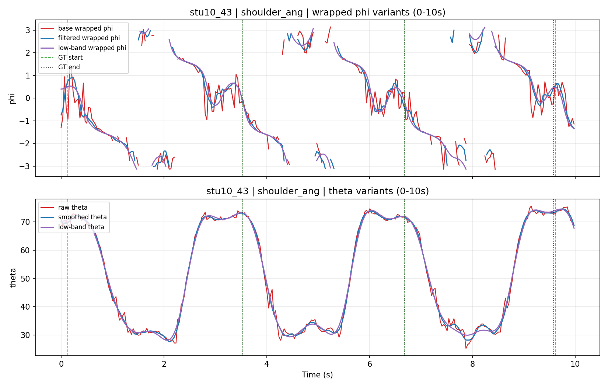

### `trunk_pitch`

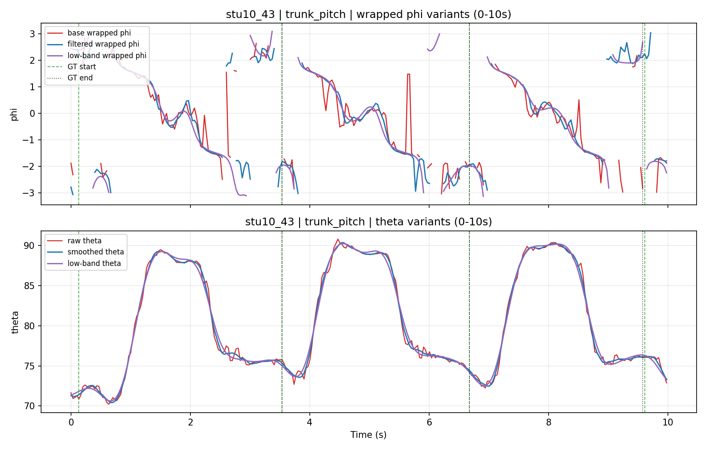

## Squat: `stu9_71`

### Clip Preview (0-10s)

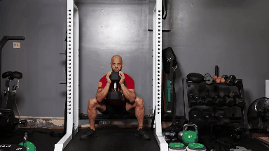

### `knee_flex`

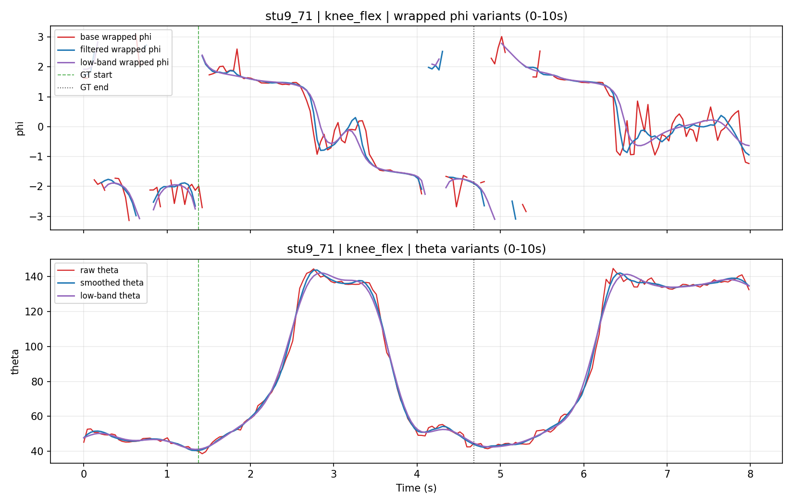

### `hip_flex`

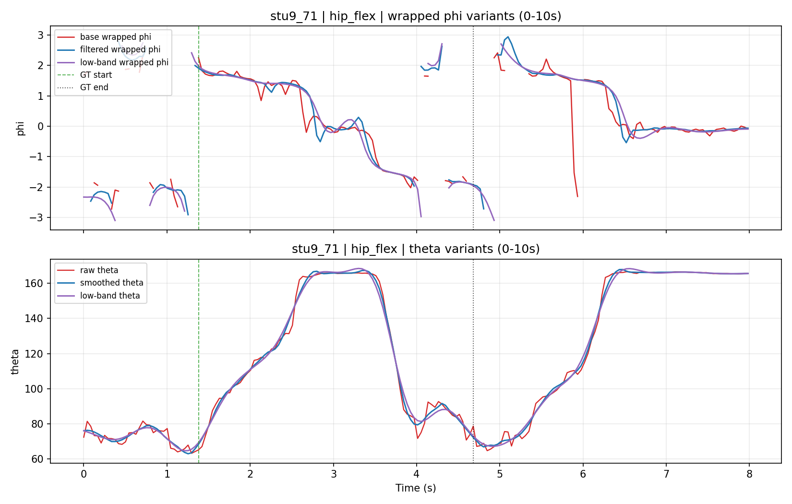

### `trunk_pitch`

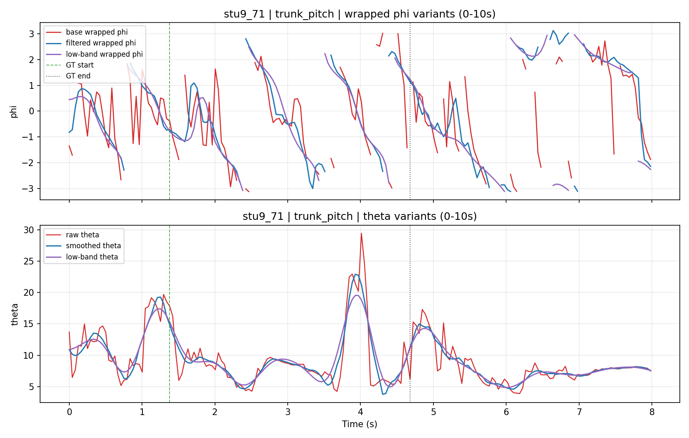

## Squat: `stu9_64`

### Clip Preview (0-10s)

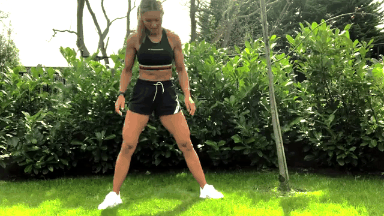

### `knee_flex`

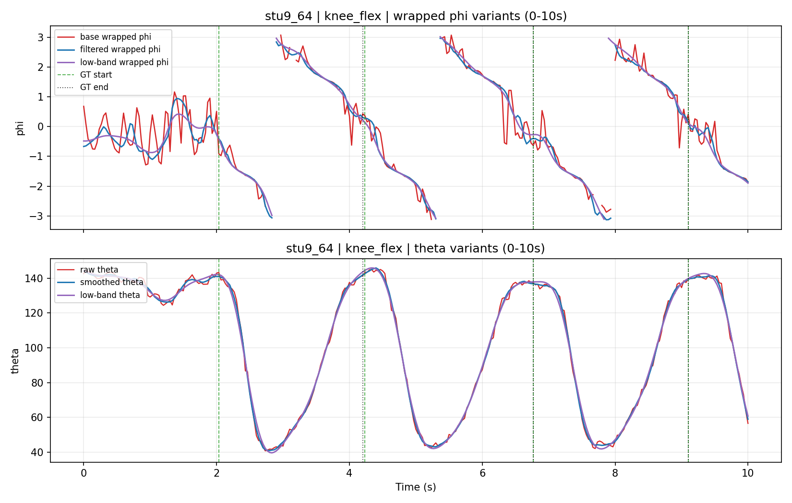

### `hip_flex`

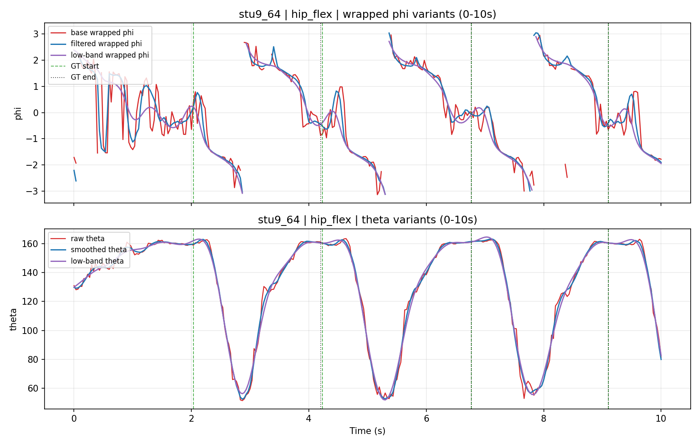

### `trunk_pitch`

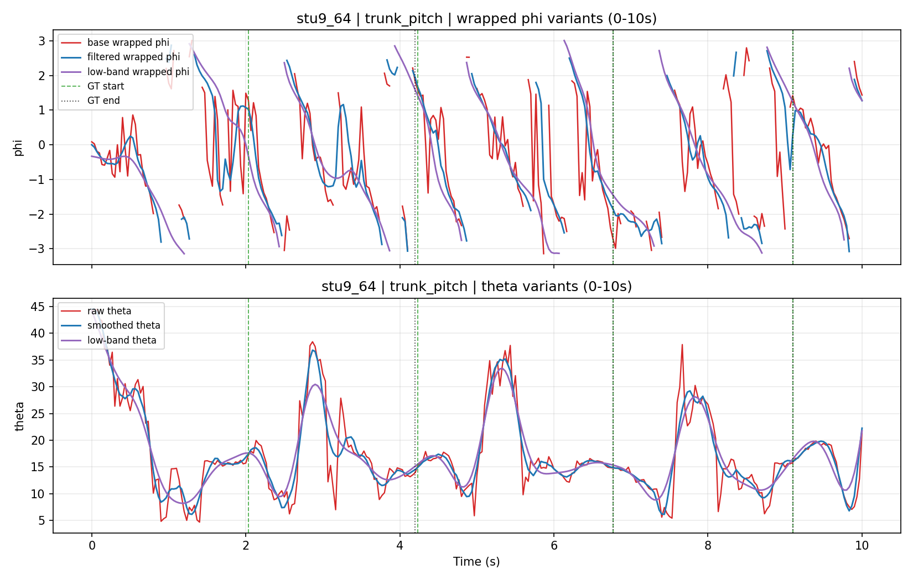

## Push-up: `stu8_46`

### Clip Preview (0-10s)

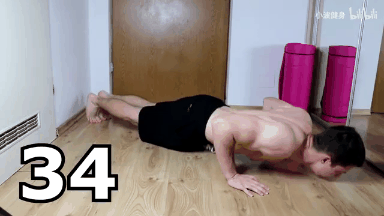

### `elbow_flex`

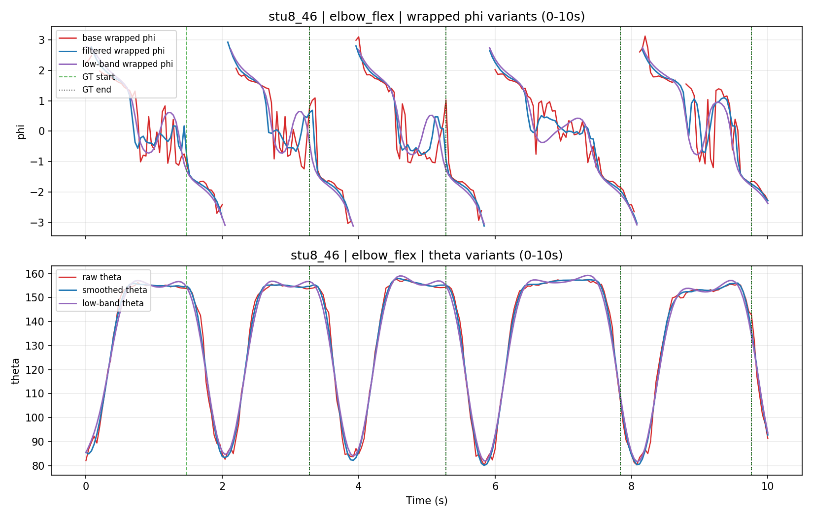

### `shoulder_ang`

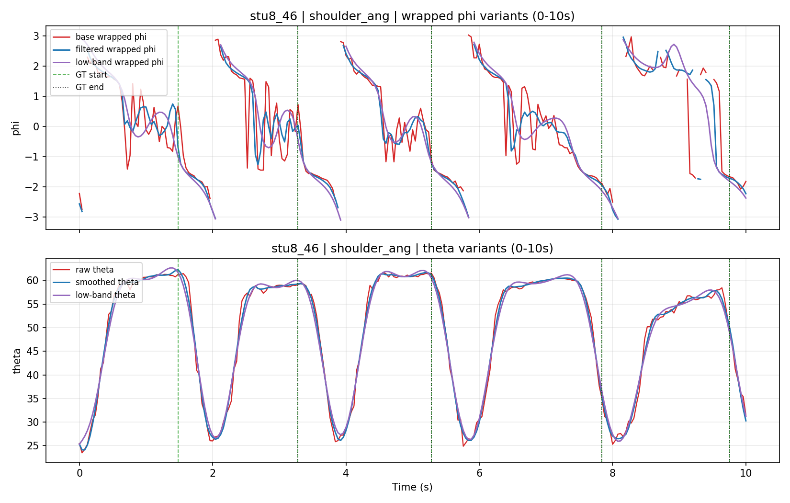

### `trunk_pitch`

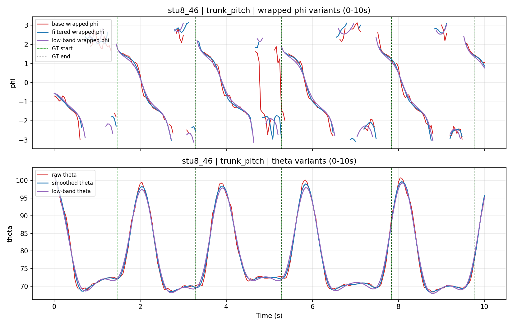

## Summary CSVs

- `docs/assets/joint_variant_two_videos/summary.csv`
- `docs/assets/joint_variant_requested_videos/summary.csv`

## Notes

- These figures are intended for qualitative explanation of signal behavior.
- Wrapped phi preserves discontinuities at the phase branch cut.
- All wrapped-phi variants use the same normalization style; the only difference is whether the source signal is raw, smoothed, or low-band filtered.
- Smoothed theta is the signal used in the current phase pipeline before phase construction.
- Low-band theta/phi are additional comparison views and are not yet part of the main counting pipeline.
